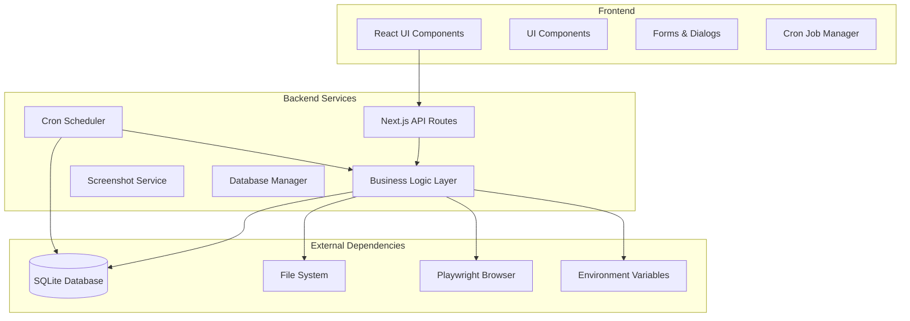

# Design Document

## Overview

Orbis is architected as a Next.js 15 application with App Router, providing a modern web interface for screenshot management. The system uses a layered architecture with clear separation between presentation, business logic, and data persistence layers. The application leverages Playwright for browser automation, SQLite for local data storage, and implements a secure credential management system using environment variables.

## Architecture

### High-Level Architecture



### Technology Stack

- **Frontend**: React 18, Next.js 15 with App Router, TypeScript
- **Styling**: Tailwind CSS, shadcn/ui components
- **Backend**: Next.js API Routes, Node.js runtime
- **Database**: SQLite with better-sqlite3
- **Browser Automation**: Playwright (Chromium)
- **Scheduling**: node-cron for cron job management
- **File Storage**: Local file system with organized directory structure
- **Security**: Environment-based credential management

## Components and Interfaces

### Frontend Components

#### Dashboard Component (`app/page.tsx`)
- **Purpose**: Main application interface displaying all screenshot targets
- **State Management**: React hooks for targets, loading states, and form visibility
- **Key Features**:
  - Target list display with metadata
  - Screenshot preview integration
  - Action buttons for CRUD operations
  - Bulk screenshot execution

#### Target Form Component (`components/target-form.tsx`)
- **Purpose**: Modal form for creating and editing screenshot targets
- **Features**:
  - Dynamic URL management (add/remove multiple URLs)
  - Login configuration toggle with conditional fields
  - Form validation and error handling
  - Responsive design with proper accessibility

#### Screenshot Preview Component (`components/screenshot-preview.tsx`)
- **Purpose**: Display thumbnail previews and full-size screenshot modals
- **Features**:
  - Lazy loading of screenshot data
  - Modal gallery for full-size viewing
  - Error handling for missing images
  - Session-based screenshot grouping

#### Cron Job Manager Component (`components/cron-job-manager.tsx`)
- **Purpose**: Interface for managing scheduled screenshot captures
- **Features**:
  - CRUD operations for cron jobs
  - Cron expression validation and builder
  - Target selection for scheduled jobs
  - Job execution history and status display

### API Layer

#### Targets API (`/api/targets`)
- **GET**: Retrieve all screenshot targets with associated URLs
- **POST**: Create new screenshot target with validation
- **PUT**: Update existing target configuration
- **DELETE**: Remove target and associated data

#### Screenshot Execution API (`/api/screenshot/run`)
- **POST**: Execute screenshot capture for all or selected targets
- **Features**:
  - Asynchronous processing with progress tracking
  - Error aggregation and reporting
  - Browser instance management

#### Screenshot Serving API (`/api/screenshots/[...path]`)
- **GET**: Serve screenshot images with security validation
- **Features**:
  - Path traversal protection
  - Content-type validation
  - Caching headers for performance

#### Cron Jobs API (`/api/cron-jobs`)
- **GET**: Retrieve all configured cron jobs with schedules and target associations
- **POST**: Create new cron job with validation of cron expression and target selection
- **PUT**: Update existing cron job configuration including schedule and targets
- **DELETE**: Remove cron job and stop scheduled execution

### Business Logic Layer

#### Database Manager (`lib/db.ts`)
- **Purpose**: Centralized database operations with schema management
- **Features**:
  - Automatic schema migration from legacy versions
  - CRUD operations for targets and URLs
  - Connection pooling and error handling
  - Type-safe query interfaces

#### Screenshot Service (`lib/screenshot.ts`)
- **Purpose**: Browser automation and screenshot capture orchestration
- **Features**:
  - Browser lifecycle management
  - Authentication handling for login-required sites
  - Multi-URL processing per target
  - Error recovery and reporting

#### Screenshot Utilities (`lib/screenshot-utils.ts`)
- **Purpose**: File system operations for screenshot management
- **Features**:
  - Session-based screenshot retrieval
  - File organization and naming conventions
  - Directory traversal and filtering

## Data Models

### Database Schema

#### Targets Table
```sql
CREATE TABLE targets (
  id INTEGER PRIMARY KEY AUTOINCREMENT,
  name TEXT NOT NULL UNIQUE,
  requiresLogin BOOLEAN NOT NULL DEFAULT 0,
  loginUrl TEXT,
  usernameSelector TEXT,
  passwordSelector TEXT,
  submitSelector TEXT,
  usernameEnvKey TEXT,
  passwordEnvKey TEXT,
  createdAt DATETIME DEFAULT CURRENT_TIMESTAMP,
  updatedAt DATETIME DEFAULT CURRENT_TIMESTAMP
);
```

#### Target URLs Table
```sql
CREATE TABLE target_urls (
  id INTEGER PRIMARY KEY AUTOINCREMENT,
  targetId INTEGER NOT NULL,
  name TEXT NOT NULL,
  url TEXT NOT NULL,
  createdAt DATETIME DEFAULT CURRENT_TIMESTAMP,
  FOREIGN KEY (targetId) REFERENCES targets (id) ON DELETE CASCADE
);
```

#### Cron Jobs Table
```sql
CREATE TABLE cron_jobs (
  id INTEGER PRIMARY KEY AUTOINCREMENT,
  name TEXT NOT NULL UNIQUE,
  cronExpression TEXT NOT NULL,
  isActive BOOLEAN NOT NULL DEFAULT 1,
  lastRun DATETIME,
  nextRun DATETIME,
  createdAt DATETIME DEFAULT CURRENT_TIMESTAMP,
  updatedAt DATETIME DEFAULT CURRENT_TIMESTAMP
);
```

#### Cron Job Targets Table
```sql
CREATE TABLE cron_job_targets (
  id INTEGER PRIMARY KEY AUTOINCREMENT,
  cronJobId INTEGER NOT NULL,
  targetId INTEGER NOT NULL,
  createdAt DATETIME DEFAULT CURRENT_TIMESTAMP,
  FOREIGN KEY (cronJobId) REFERENCES cron_jobs (id) ON DELETE CASCADE,
  FOREIGN KEY (targetId) REFERENCES targets (id) ON DELETE CASCADE,
  UNIQUE(cronJobId, targetId)
);
```

### TypeScript Interfaces

#### ScreenshotTarget Interface
```typescript
interface ScreenshotTarget {
  id?: number;
  name: string;
  requiresLogin: boolean;
  loginUrl?: string;
  usernameSelector?: string;
  passwordSelector?: string;
  submitSelector?: string;
  usernameEnvKey?: string;
  passwordEnvKey?: string;
  createdAt?: string;
  updatedAt?: string;
  urls?: ScreenshotUrl[];
}
```

#### ScreenshotUrl Interface
```typescript
interface ScreenshotUrl {
  id?: number;
  targetId: number;
  name: string;
  url: string;
  createdAt?: string;
}
```

#### CronJob Interface
```typescript
interface CronJob {
  id?: number;
  name: string;
  cronExpression: string;
  isActive: boolean;
  lastRun?: string;
  nextRun?: string;
  createdAt?: string;
  updatedAt?: string;
  targets?: ScreenshotTarget[];
}
```

#### CronJobTarget Interface
```typescript
interface CronJobTarget {
  id?: number;
  cronJobId: number;
  targetId: number;
  createdAt?: string;
}
```

## Error Handling

### Error Categories and Strategies

#### Network and Browser Errors
- **Strategy**: Retry logic with exponential backoff
- **User Experience**: Clear error messages with suggested actions
- **Logging**: Detailed error context for debugging

#### Authentication Failures
- **Strategy**: Validate credentials before screenshot attempts
- **User Experience**: Specific guidance for credential configuration
- **Security**: Never log or expose actual credential values

#### File System Errors
- **Strategy**: Automatic directory creation and permission validation
- **User Experience**: Clear error messages with file path context
- **Recovery**: Graceful degradation when storage is unavailable

#### Database Errors
- **Strategy**: Transaction rollback and data integrity protection
- **User Experience**: User-friendly error messages with recovery options
- **Migration**: Automatic schema updates with backup preservation

### Error Response Format
```typescript
interface ErrorResponse {
  error: string;
  details?: string;
  code?: string;
  timestamp: string;
}
```

## Testing Strategy

### Unit Testing
- **Database Operations**: Test CRUD operations and schema migrations
- **Screenshot Service**: Mock browser interactions and test error scenarios
- **Utility Functions**: Test file operations and data transformations

### Integration Testing
- **API Endpoints**: Test complete request/response cycles
- **Browser Automation**: Test login flows and screenshot capture
- **File System Operations**: Test directory creation and file management

### End-to-End Testing
- **User Workflows**: Test complete user journeys from target creation to screenshot viewing
- **Error Scenarios**: Test error handling and recovery mechanisms
- **Performance**: Test with multiple targets and large screenshots

### Testing Tools
- **Unit Tests**: Jest with TypeScript support
- **API Testing**: Supertest for HTTP endpoint testing
- **Browser Testing**: Playwright Test for E2E scenarios
- **Database Testing**: In-memory SQLite for isolated tests

## Security Considerations

### Credential Management
- **Environment Variables**: All sensitive data stored in environment variables
- **No Database Storage**: Passwords never persisted in database
- **Validation**: Environment variable presence validated before use
- **Error Handling**: Generic error messages to prevent credential exposure

### File System Security
- **Path Validation**: Prevent directory traversal attacks
- **File Type Validation**: Only serve PNG images through API
- **Access Control**: Screenshots only accessible through authenticated API

### Browser Security
- **Headless Mode**: Default to headless browser execution
- **Resource Limits**: Memory and timeout constraints for browser operations
- **Cleanup**: Proper browser instance cleanup to prevent resource leaks

## Performance Optimization

### Database Performance
- **Indexing**: Appropriate indexes on frequently queried columns
- **Connection Management**: Singleton database connection with proper cleanup
- **Query Optimization**: Efficient joins for target and URL retrieval

### Screenshot Performance
- **Browser Reuse**: Single browser instance for multiple screenshots
- **Parallel Processing**: Concurrent screenshot capture where possible
- **Memory Management**: Proper cleanup of browser resources

### Frontend Performance
- **Lazy Loading**: Screenshot previews loaded on demand
- **Caching**: Appropriate cache headers for static assets
- **Bundle Optimization**: Code splitting and tree shaking

## Deployment and Configuration

### Environment Setup
- **Node.js**: Version 18+ required for Next.js 15 compatibility
- **Playwright**: Browser binaries installed via `npx playwright install`
- **Environment Variables**: Credential configuration in `.env` file
- **File Permissions**: Write access to screenshots and data directories

### Configuration Management
- **Database Location**: Configurable via environment variables
- **Screenshot Directory**: Configurable storage location
- **Browser Options**: Headless mode and other Playwright options
- **Port Configuration**: Next.js development and production ports

### Monitoring and Logging
- **Application Logs**: Structured logging for debugging and monitoring
- **Error Tracking**: Comprehensive error capture and reporting
- **Performance Metrics**: Screenshot capture timing and success rates
- **Health Checks**: Database connectivity and file system access validation